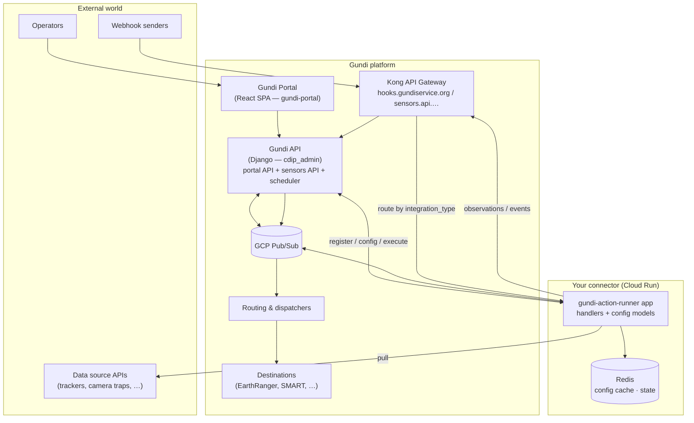

# Architecture overview

How a connector built with this framework fits into the Gundi platform, and
which services it talks to. This page is the map; the
[registration contract](registration-contract.md) and
[runtime contracts](runtime-contracts.md) pages are the territory.

## The system

A **connector** (an "action runner") is a standalone FastAPI service, one per
integration *type*, usually on Cloud Run. It owns all knowledge of the
external system: how to authenticate, pull, parse webhooks, and transform
data. The platform owns everything else: configuration storage and forms,
scheduling, routing, delivery, and the activity feed.

## The pieces

| Piece | Repo | Role |
|---|---|---|
| Action-runner framework | `gundi-integration-action-runner` | This library + project template: decorators, FastAPI app, registration, config cache, state, activity logging |
| Connectors | `gundi-integration-*` forks/scaffolds | One service per integration type, built on the framework |
| Gundi API | `cdip` (`cdip_admin` Django app) | Portal backend, sensors API, integration registry, celery-beat scheduler, activity log |
| Portal | `gundi-portal` | React SPA rendering connector-declared config forms; talks only to the Gundi API |
| Kong | (infra) | Public ingress: webhook routing by `integration_type`, per-integration API keys for the sensors API |
| Routing & dispatchers | `cdip-routing`, `gundi-dispatcher-*` | Fan data out from the raw-observations stream to destination systems |

## The four contracts

Everything between a connector and the platform reduces to four contracts,
each with its own page or section:

1. **[Registration](registration-contract.md)** — one idempotent
   `POST /v2/integrations/types/` declaring the type, its actions (schemas +
   ui schemas), crontabs, and optional webhook. This single payload drives
   everything the platform knows about a connector.
2. **[Execution](runtime-contracts.md#scheduled-pulls)** — the platform
   invokes the runner: scheduled pulls via Pub/Sub push, manual runs via the
   HTTP execute proxy, webhooks via Kong.
3. **[Configuration distribution](runtime-contracts.md#configuration-distribution)**
   — operators edit config in the portal; changes stream to runners as
   ordered Pub/Sub config events feeding a Redis cache.
4. **[Data & telemetry](runtime-contracts.md#data-path)** — the runner sends
   observations/events to the sensors API (per-integration API key) and
   publishes activity events that become the portal's activity feed.

## Life of an integration

1. **Register the type** (developer, once per deploy of new schemas):
   `gundi-runner register` → the portal can now offer this technology.
2. **Create an integration** (operator, in the portal): pick the type, name
   it, fill the config forms generated from your schemas — see
   [portal rendering](portal-rendering.md).
3. **Configure a connection**: the integration becomes a *provider* routed to
   one or more destinations. Only then are its periodic pull tasks enabled.
4. **Run**: celery beat fires crontabs → Pub/Sub → your `@action.pull`
   handler pulls, transforms, and sends data to Gundi; dispatchers deliver to
   destinations. Webhook data short-circuits the pull: Kong → your
   `@webhook` handler → same send path.
5. **Observe**: every start/completion/failure your runner publishes shows up
   in the portal's activity feed.
