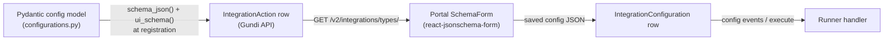

# Portal rendering contract

How a connector's Pydantic config models become configuration forms in the
Gundi portal — and which knobs the connector controls.

## The pipeline



The connector never writes HTML or React. It declares fields on a config
model; registration serializes two JSON documents per action — the **JSON
Schema** (`schema`, from `Model.schema_json()`) and the **ui schema**
(`ui_schema`, from `Model.ui_schema()`) — and the portal renders both with
[react-jsonschema-form](https://rjsf-team.github.io/react-jsonschema-form/)
(`@rjsf`) plus custom templates. Whatever the operator saves must validate
against the same Pydantic model when the action executes.

## Declaring fields: `FieldWithUIOptions`

```python
from gundi_action_runner.services.utils import (
    FieldWithUIOptions, UIOptions, GlobalUISchemaOptions,
)

class PullEventsConfig(PullActionConfiguration):
    api_key: pydantic.SecretStr = FieldWithUIOptions(
        ...,
        title="API Key",
        description="Issued by the provider's admin console",
        format="password",
        ui_options=UIOptions(widget="password"),
    )
    days_to_sync: int = FieldWithUIOptions(
        7, title="Days to sync", ge=1, le=30,
        ui_options=UIOptions(widget="range"),
    )
    ui_global_options: GlobalUISchemaOptions = GlobalUISchemaOptions(
        order=["api_key", "days_to_sync"],
    )
```

`FieldWithUIOptions` accepts everything `pydantic.Field` does (validation
constraints land in the JSON Schema as usual) plus `ui_options=UIOptions(...)`.
`ui_schema()` (from `UISchemaModelMixin`) emits one `ui:*` block per field
that set `ui_options`, and hoists `ui_global_options` fields to top-level
`ui:` keys:

```json
{
  "api_key": {"ui:widget": "password"},
  "days_to_sync": {"ui:widget": "range"},
  "ui:order": ["api_key", "days_to_sync"]
}
```

### `UIOptions` fields

All optional; only what you set is emitted. The names mirror rjsf's
[ui schema options](https://rjsf-team.github.io/react-jsonschema-form/docs/api-reference/uiSchema).

| Group | Fields |
|---|---|
| Widget & input | `widget`, `inputType`, `placeholder`, `rows`, `autofocus`, `autocomplete`, `inline` |
| Labels & help | `title`, `description`, `help`, `label`, `enumNames` |
| State | `disabled`, `readonly`, `hideError`, `emptyValue`, `enumDisabled` |
| Arrays/objects | `order`, `addable`, `orderable`, `removable`, `copyable`, `duplicateKeySuffixSeparator` |
| Styling | `classNames`, `style`, `filePreview`, `submitButtonOptions` |

`GlobalUISchemaOptions` is the subset (`order`, `addable`, `copyable`,
`orderable`, `removable`, `label`, `duplicateKeySuffixSeparator`) valid at
form level via the `ui_global_options` field.

## What the portal does with it

The portal (`gundi-portal`, React + `@rjsf`) renders each action's schema
pair as a collapsible form section, with custom field templates, Tailwind
styling, and a few conventions a connector author should know:

- **Actions with an empty schema are hidden.** No properties → no form
  section. Use this deliberately for actions that need no operator input.
- **Action lists are filtered by surface.** Provider (source) configuration
  screens hide `push` actions; destination screens hide `pull` actions.
  `reference` actions are never rendered as forms (see below).
- **`is_executable` (in the action's `schema`) drives the Test button.**
  Config models mixing in `ExecutableActionMixin` get an execute affordance
  in the portal (e.g. the auth action's "Test Connection"), wired to the
  execute proxy described in [Runtime contracts](runtime-contracts.md).
- **Titles**: the action's display name comes from the decorator's `title=`;
  a `ui:title` in the ui schema overrides the form section heading.
- **Widgets**: `password` masks input, and the portal supplies its own
  widget set for common types; unknown widget names fall back to defaults.
- **Validation is enforced twice** — AJV in the portal on save, Pydantic in
  the runner on execute. Keep the model authoritative; don't rely on
  UI-only constraints.

## Live reference data (`gundi:reference`)

A field whose ui schema entry carries a `gundi:reference` annotation renders
as a **live dropdown**: the portal lazily executes a *reference action* on
the runner (through the execute proxy) when the menu opens, and offers the
returned options.

```jsonc
"event_types": {
  "items": {
    "gundi:reference": {
      "action": "list_event_types",     // reference action id on this runner
      "target": "self",                 // or "provider" (destination forms)
      "params": {"category": {"$data": "../category"}},  // cascading dropdowns
      "allow_free_text": true           // combobox (default) vs strict select
    }
  }
}
```

Reference actions are stateless read-only queries (`type: "reference"`,
config model subclassing `ReferenceActionConfiguration` — the config *is*
the query) that authenticate with the integration's saved auth config and
return `{options: [{value, label?, description?, group?}], cache_ttl_seconds,
truncated}`. The portal never blocks on them: fetch failures, unresolved
`$data` params, or an unsupported portal degrade the field to the plain text
input, and a saved value missing from the fetched options is flagged but
never cleared.

**Status (as of 2026-08-11):** the portal widget has shipped
(`gundi-portal` PR #340). The Gundi API's `reference` action type is on the
unmerged `feature/reference-action-type` branch, and template-based
connectors with reference actions (EarthRanger, CMORE) keep registration
gated behind a default-off flag until it lands. The library-native
`@action.reference` decorator is designed but not yet released. Because the
annotation never sets `ui:widget`, portals without reference support simply
render the plain text input — annotations are always safe to register.

## Ground rules

- **The annotation channel is additive.** Unknown `ui:*` or vendor keys
  (like `gundi:reference`) are ignored by older portals; never repurpose a
  key rjsf already defines.
- **Don't leak secrets into schemas.** Field *values* are never in the
  schema, but defaults are — no real credentials in `default=`, examples,
  or descriptions.
- **Schema changes are registration-time.** Editing a config model does
  nothing until `gundi-runner register` runs again; existing saved configs
  are not migrated, so keep changes backward compatible (new fields need
  defaults).
