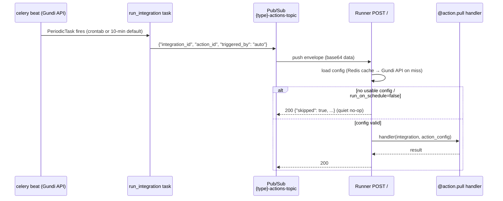
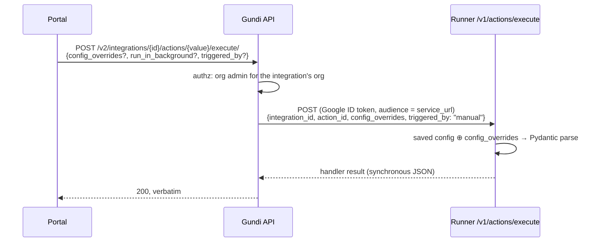
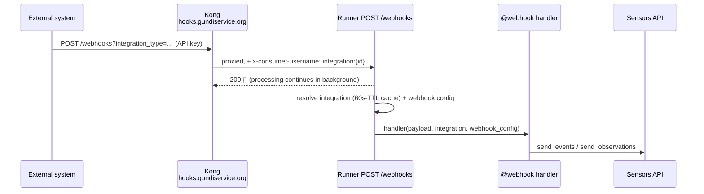
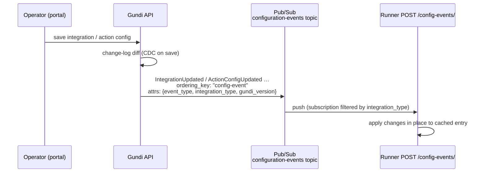
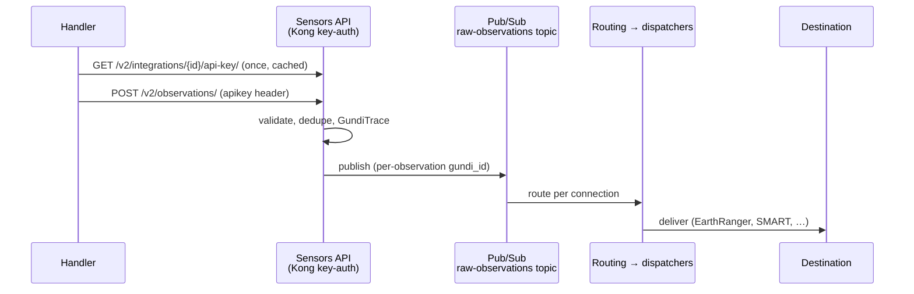

# Runtime contracts

The four ways a running connector and the platform talk to each other:
action execution (scheduled and manual), configuration distribution, the
data path, and activity telemetry. Endpoint paths and payload fields here
are the actual wire contract — treat changes to any of them as breaking.

## Runner endpoints at a glance

| Method | Path | Caller | Purpose |
|---|---|---|---|
| `POST` | `/` | Pub/Sub push | Execute an action (scheduled pulls land here) |
| `POST` | `/push-data` | Pub/Sub push | Push actions, routed by `destination_id` attribute |
| `POST` | `/v1/actions/execute` | Gundi API (execute proxy) | Manual/portal-triggered execution |
| `GET` | `/v1/actions/` | anyone | List registered action ids |
| `POST` | `/webhooks` | Kong | Third-party webhook ingest |
| `POST` | `/config-events/` | Pub/Sub push | Config-change events → cache updates |

## Scheduled pulls

When an operator saves a config for a `pull` action, the Gundi API creates a
`django_celery_beat.PeriodicTask`: the action's registered crontab, or a
**10-minute interval default** when none was registered. The task is only
**enabled while the integration is used as a provider** in at least one
connection, and it follows the integration's `enabled` flag.

Each firing publishes a three-key JSON message to the type's topic
(`{slug-without-separators}-actions-topic`, e.g. `earthranger-actions-topic`).
The runner receives it as a Pub/Sub push on `POST /`.

`triggered_by: "auto"` is load-bearing: for automated runs, a missing config,
a config that fails validation, or `run_on_schedule: false` produces a
**quiet skip** (`{"skipped": true, "reason": …}`) rather than an error —
pull actions are scheduled type-wide, so destination-only integrations of
the same type get fired too and must no-op cleanly. Invalid configs
additionally emit a throttled WARNING to the activity feed (once per hour).
Handlers run under a timeout (`MAX_ACTION_EXECUTION_TIME`, default 540s).

## Manual execution (the execute proxy)

The portal's "Test Connection" button — and any programmatic manual run —
goes through the Gundi API, never directly to the runner. The proxy:

- authorizes **org admins** of the integration's owning organization
  (viewers can't execute);
- resolves the runner by the type's `service_url` and authenticates
  service-to-service with a **Google ID token** (audience = the service URL);
- passes `config_overrides`, which the runner **merges over the saved
  action config** before Pydantic validation — the saved config may even be
  absent if overrides alone satisfy the model;
- defaults `triggered_by` to `"manual"`, which keeps **strict error
  semantics**: missing config is a 404, invalid config a 422, handler
  timeout a 504 — no quiet skipping.

Two subtleties worth knowing:

- The synchronous proxy path writes **no activity log of its own**. What you
  see in the portal feed for a manual run is the runner's own
  started/complete/failed events arriving asynchronously (below).
- `config_overrides` overrides the **action's own config only**. It cannot
  substitute another action's config (notably: it cannot supply unsaved auth
  credentials — a limitation with an approved design fix, see the
  ephemeral-execution spec in `gundi-portal`).

## Webhooks

There is **one public webhook host** (`hooks.gundiservice.org`; per-env
variants for dev/stage). Kong authenticates the caller's per-integration API
key, resolves the target runner from the `integration_type` registered at
[registration time](registration-contract.md), and injects
`x-consumer-username: integration:{uuid}` — which is how the runner knows
which integration a payload belongs to (fallbacks: `x-gundi-integration-id`
header, `integration_id` query param).

The runner responds `{}` immediately (background processing by default) and
then: loads the integration's webhook config, parses the payload per the
configured mode (fixed Pydantic model, runtime-built dynamic schema, JQ
transform, or hex-string decoding), and calls your handler. Sending the
transformed data to Gundi is the handler's job, via the framework's sender
functions.

## Configuration distribution

Runners never poll for config. They keep a Redis cache
(`REDIS_CONFIGS_DB`), cold-filled from `GET /v2/integrations/{id}/` and then
**maintained by ordered config events**:

The Gundi API derives events from its change-log (CDC): `Integration*` and
`ActionConfig*` `Created/Updated/Deleted`, published with **message
ordering** enabled and an `integration_type` attribute so each runner's
subscription only receives its own type's events. Update events carry
field-level `changes` deltas, which the consumer applies **in place** to the
cached entry — cache update, not blunt invalidation.

Caveat: **webhook configurations are not covered by config events** — the
webhook path re-reads them with a 60-second TTL instead. Expect up to a
minute of staleness there.

## Data path

`send_observations_to_gundi()` / `send_events_to_gundi()` (and the message/
attachment variants) each require `integration_id=`: the framework fetches
that integration's API key from the Gundi API and posts to the sensors API
(`sensors.api.gundiservice.org`, same Django app behind Kong key-auth). The
key is bound to the integration — the sensors API rejects payloads whose
API key doesn't match the claimed integration. From there, data is deduped,
traced (`GundiTrace`), and republished to the routing stream that fans out
to each connection's destinations.

## Activity telemetry

Everything in the portal's activity feed arrives **from the runner, via
Pub/Sub** (`integration-events` topic) — not from HTTP responses:

| Published by | Events |
|---|---|
| `@activity_logger()` decorator | `IntegrationActionStarted` / `Complete` / `Failed` |
| `@webhook_activity_logger()` | `IntegrationWebhookStarted` / `Complete` / `Failed` |
| `log_action_activity()` / `log_webhook_activity()` | Custom log lines at a chosen level |
| Framework error handling | `ActionExecutionFailed` on every handled failure, with classified, human-first error text |

A consumer on the Gundi API side turns each event into an `ActivityLog` row.
The path is asynchronous and best-effort (the consumer acks even on handler
exceptions), so treat the feed as observability, not as a ledger.

Failure classification: HTTP 401/403 from the provider render as
authentication failures, 429 as rate limiting, 5xx as a bad provider
response, connection errors as connectivity — or raise an
`IntegrationError` subclass yourself for precise control (see the
[extension API](extension-api.md#error-reporting)).
